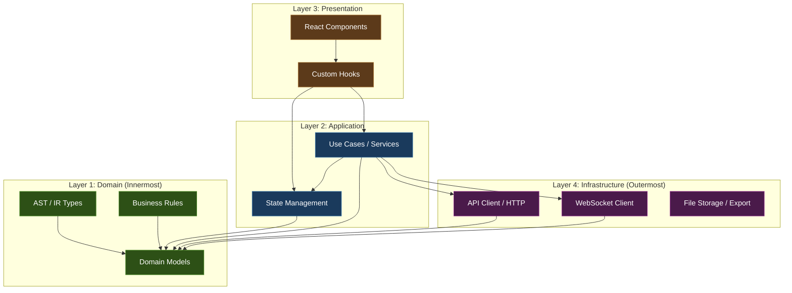
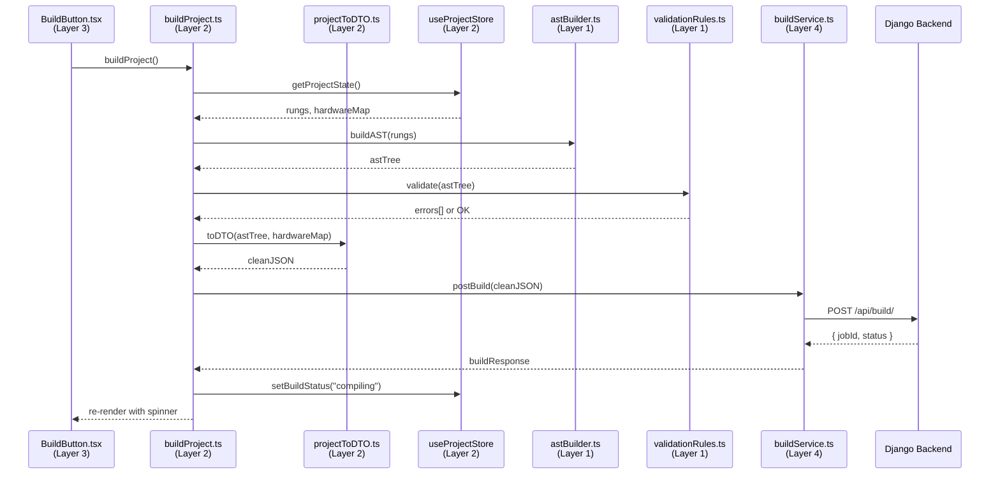

# ESP Flow — Frontend Software Architecture

> **Architecture Pattern:** Clean Architecture (Adapted for Frontend)  
> **Design Principles:** SOLID, Separation of Concerns, Dependency Inversion  
> **Organization Strategy:** Domain-Driven Design (DDD) with Feature Slicing

---

## 1. Architectural Standards & References

This architecture is built on established software engineering standards. Each principle referenced below has a direct impact on how we structure the codebase.

| Standard | Author / Source | What It Governs | Reference |
|---|---|---|---|
| **Clean Architecture** | Robert C. Martin (Uncle Bob) | The 4-layer structure and the Dependency Rule | [Clean Architecture Blog Post](https://blog.cleancoder.com/uncle-bob/2012/08/13/the-clean-architecture.html) |
| **SOLID Principles** | Robert C. Martin | Class/module design (Single Responsibility, Open/Closed, etc.) | [SOLID Wikipedia](https://en.wikipedia.org/wiki/SOLID) |
| **Domain-Driven Design (DDD)** | Eric Evans | Organizing code around business domains (features) | [DDD Reference](https://www.domainlanguage.com/ddd/reference/) |
| **Feature-Sliced Design (FSD)** | FSD Community | Frontend-specific architectural methodology for scalable apps | [feature-sliced.design](https://feature-sliced.design/) |
| **Dependency Inversion Principle** | Robert C. Martin | High-level modules must not depend on low-level modules | Part of SOLID |
| **IEC 61131-3** | International Electrotechnical Commission | The PLC programming standard our domain models | [IEC 61131-3](https://webstore.iec.ch/en/publication/68533) |

---

## 2. The Dependency Rule (The Most Important Rule)



> [!IMPORTANT]
> **The Dependency Rule:** Dependencies can ONLY point **inward**. Layer 1 (Domain) knows nothing about React, Axios, or WebSockets. Layer 4 (Infrastructure) knows nothing about React components. A React component (Layer 3) calls a Use Case (Layer 2), which calls the API Client (Layer 4), which serializes a Domain Model (Layer 1). **Never the reverse.**

---

## 3. The Four Layers — Detailed Breakdown

### Layer 1: Domain Layer (The Core — Zero Dependencies)

This layer contains the **pure business logic** of PLC programming. It has absolutely no imports from React, Axios, Zustand, or any framework. It is pure TypeScript. If you ripped out React tomorrow and replaced it with Vue, this layer would remain 100% untouched.

```
src/domain/
├── models/
│   ├── memoryMap.ts          # X[], Y[], M[], T[], C[], D[] type definitions
│   ├── contact.ts            # Contact model (NO, NC, RisingEdge, FallingEdge)
│   ├── coil.ts               # Coil model (Standard, Set, Reset, Negated)
│   ├── functionBlock.ts      # Timer (TON/TOFF), Counter (CTU/CTD), Comparator
│   ├── rung.ts               # A single rung containing a logic tree + output
│   ├── program.ts            # A complete program (ordered list of rungs)
│   └── hardwareConfig.ts     # GPIO-to-Memory address mapping
│
├── ast/
│   ├── astNode.ts            # The AST node types (AND, OR, NOT, CONTACT, COIL)
│   └── astBuilder.ts         # Pure functions to construct an AST from a rung
│
├── rules/
│   ├── validationRules.ts    # Business rules (e.g., "No double coils on same address")
│   ├── addressResolver.ts    # Validates memory addresses (X0-X255, M0-M1023, etc.)
│   └── scanCycleRules.ts     # Rules for execution order and retentive behavior
│
└── interfaces/
    ├── IProjectRepository.ts # Interface (contract) for saving/loading projects
    ├── IBuildService.ts      # Interface (contract) for triggering builds
    └── IMonitoringService.ts # Interface (contract) for real-time PLC monitoring
```

> [!NOTE]
> **Why `interfaces/`?** This is the **Dependency Inversion Principle** in action. The Domain layer defines *what* it needs (e.g., "I need a way to save a project") but does NOT define *how* (Axios, fetch, localStorage). The Infrastructure layer implements the *how*. This means you can swap Django for Firebase without touching any business logic.

---

### Layer 2: Application Layer (Orchestration — The "Use Cases")

This layer orchestrates the flow of data between the Domain, the Store, and the Infrastructure. Each file represents a single **Use Case** — a specific action the user can perform.

```
src/application/
├── useCases/
│   ├── project/
│   │   ├── createProject.ts       # Initialize a blank project with default memory map
│   │   ├── saveProject.ts         # Serialize state → call repository → confirm save
│   │   ├── loadProject.ts         # Fetch from backend → deserialize → hydrate store
│   │   └── exportProject.ts       # Export project as JSON file
│   │
│   ├── ladder/
│   │   ├── addRung.ts             # Insert a new rung at a position
│   │   ├── deleteRung.ts          # Remove a rung and reindex
│   │   ├── addContact.ts          # Place a contact into a rung's logic tree
│   │   ├── addCoil.ts             # Assign an output coil to a rung
│   │   ├── addBranch.ts           # Create a parallel OR branch in a rung
│   │   └── moveElement.ts         # Drag-and-drop reordering within a rung
│   │
│   ├── hardware/
│   │   ├── assignPin.ts           # Map a GPIO pin to an X/Y address
│   │   ├── removePin.ts           # Unmap a GPIO pin
│   │   └── detectConflicts.ts     # Check for duplicate pin assignments
│   │
│   ├── compiler/
│   │   ├── buildProject.ts        # Serialize AST → POST to Django → poll status
│   │   └── downloadFirmware.ts    # Fetch the compiled .zip from the backend
│   │
│   └── monitoring/
│       ├── connectToDevice.ts     # Open WebSocket to Django Channels
│       ├── disconnectDevice.ts    # Gracefully close the socket
│       └── syncMemoryState.ts     # Update the store with live X/Y/M values
│
├── store/
│   ├── useProjectStore.ts         # Zustand slice: Project metadata, AST, hardware map
│   ├── useLadderStore.ts          # Zustand slice: Rungs, selected element, clipboard
│   ├── useUIStore.ts              # Zustand slice: Panel visibility, theme, zoom level
│   └── useMonitoringStore.ts      # Zustand slice: Live memory state, connection status
│
└── mappers/
    ├── rungToAST.ts               # Transforms a visual Rung into an AST tree
    ├── astToCpp.ts                # (Preview only) Transforms AST into C++ string
    └── projectToDTO.ts            # Transforms internal state into Django-compatible JSON
```

> [!TIP]
> **Why `mappers/`?** The shape of data that is easy to render in React (flat arrays with IDs) is NOT the shape Django expects (nested AST trees). Mappers are the dedicated translation layer that converts between these two shapes. This follows the **Single Responsibility Principle** — React components never transform data, they only display it.

---

### Layer 3: Presentation Layer (React — Pure UI)

This layer contains React components, hooks, and styling. Components here are intentionally "dumb" — they read from the store and call use cases. They contain zero business logic.

```
src/presentation/
├── app/
│   ├── App.tsx                    # Root component: layout shell, router
│   ├── routes.tsx                 # Page-level routing (Editor, Dashboard, Settings)
│   └── providers.tsx              # Context providers (Theme, Auth, Toast)
│
├── layouts/
│   ├── EditorLayout.tsx           # The 3-panel IDE layout (sidebar + canvas + props)
│   └── DashboardLayout.tsx        # The project list / home screen layout
│
├── features/
│   ├── ladder-editor/
│   │   ├── components/
│   │   │   ├── LadderCanvas.tsx       # The main canvas container (scrollable grid)
│   │   │   ├── Rung.tsx               # A single horizontal rung row
│   │   │   ├── RungToolbar.tsx        # "+branch", "delete" controls per rung
│   │   │   ├── ContactSymbol.tsx      # SVG rendering of ─┤├─ or ─┤/├─
│   │   │   ├── CoilSymbol.tsx         # SVG rendering of ─( )─ or ─(S)─
│   │   │   ├── BranchGroup.tsx        # Parallel branch container with vertical lines
│   │   │   ├── PowerRail.tsx          # The left and right vertical power rails
│   │   │   └── DropZone.tsx           # Visual drop target for drag-and-drop
│   │   ├── hooks/
│   │   │   ├── useDragBlock.ts        # Drag-and-drop mechanics for contacts/coils
│   │   │   └── useRungSelection.ts    # Click-to-select a contact or coil
│   │   └── index.ts                   # Public API barrel export
│   │
│   ├── block-library/
│   │   ├── components/
│   │   │   ├── LibraryPanel.tsx       # Left sidebar with categorized blocks
│   │   │   ├── BlockCategory.tsx      # "CONTACTS", "COILS & RELAYS" headers
│   │   │   └── DraggableBlock.tsx     # Individual draggable item
│   │   └── index.ts
│   │
│   ├── properties-panel/
│   │   ├── components/
│   │   │   ├── PropertiesPanel.tsx    # Right sidebar (switches based on selection)
│   │   │   ├── ContactProperties.tsx  # Address, Data Type, Retentive, Comment
│   │   │   ├── CoilProperties.tsx     # Address, Mode (Set/Reset), Comment
│   │   │   ├── TimerProperties.tsx    # Preset time, Timer type (TON/TOFF)
│   │   │   └── CounterProperties.tsx  # Preset count, Counter type (CTU/CTD)
│   │   └── index.ts
│   │
│   ├── hardware-config/
│   │   ├── components/
│   │   │   ├── HardwareModal.tsx      # Full-screen modal for GPIO mapping
│   │   │   ├── PinMappingTable.tsx    # Table: GPIO ↔ Memory Address
│   │   │   └── BoardVisualizer.tsx    # (Future) Visual ESP32 pinout diagram
│   │   └── index.ts
│   │
│   ├── compiler/
│   │   ├── components/
│   │   │   ├── BuildButton.tsx        # "Build" button with spinner state
│   │   │   ├── BuildLog.tsx           # Real-time build output console
│   │   │   └── DownloadPanel.tsx      # Download .zip after successful build
│   │   └── index.ts
│   │
│   ├── monitoring/
│   │   ├── components/
│   │   │   ├── ConnectionBadge.tsx    # "PLC-04 online" green dot indicator
│   │   │   ├── MemoryWatchTable.tsx   # Live table showing X/Y/M/D values
│   │   │   └── LiveHighlighter.tsx    # Overlay that turns active contacts green
│   │   └── index.ts
│   │
│   └── toolbar/
│       ├── components/
│       │   ├── MainToolbar.tsx        # Top bar: Save, Build, Export, Settings
│       │   └── UserMenu.tsx           # User avatar, logout
│       └── index.ts
│
└── shared/
    ├── components/
    │   ├── Button.tsx                 # Reusable styled button
    │   ├── Modal.tsx                  # Reusable modal wrapper
    │   ├── Dropdown.tsx               # Reusable dropdown (for address selection)
    │   ├── Table.tsx                  # Reusable data table
    │   └── Tooltip.tsx                # Reusable tooltip
    └── hooks/
        ├── useKeyboardShortcuts.ts    # Global hotkeys (Ctrl+S, Ctrl+Z, Delete)
        └── useUndoRedo.ts             # Undo/Redo stack management
```

---

### Layer 4: Infrastructure Layer (The Outside World)

This layer implements the interfaces defined in Layer 1. It handles all external I/O: HTTP, WebSocket, browser storage, file downloads.

```
src/infrastructure/
├── api/
│   ├── axiosClient.ts             # Axios instance with baseURL, JWT interceptor
│   ├── projectRepository.ts       # Implements IProjectRepository using Axios
│   ├── buildService.ts            # Implements IBuildService (POST /api/build/)
│   └── authService.ts             # Login, logout, token refresh via DRF
│
├── websocket/
│   ├── monitoringSocket.ts        # Implements IMonitoringService via Django Channels
│   └── reconnectionManager.ts     # Auto-reconnect with exponential backoff
│
├── storage/
│   ├── localStorageAdapter.ts     # Save/load draft projects to browser localStorage
│   └── fileExporter.ts            # Trigger browser download of .zip or .json files
│
└── config/
    ├── endpoints.ts               # All Django API endpoint URLs in one place
    └── environment.ts             # Dev vs. Production environment variables
```

> [!NOTE]
> **Why does `projectRepository.ts` exist separately from the use case?** Because of Dependency Inversion. The use case `saveProject.ts` calls `IProjectRepository.save()`. It has no idea whether that goes to Django via Axios, or to localStorage, or to a mock during unit tests. You can swap the entire backend without changing a single line in Layers 1, 2, or 3.

---

## 4. Data Flow — Complete Example

**User Action:** Clicks "Build" button.



---

## 5. The Complete `src/` Tree

```
src/
├── domain/                    # Layer 1: Pure business logic (ZERO framework imports)
│   ├── models/
│   ├── ast/
│   ├── rules/
│   └── interfaces/
│
├── application/               # Layer 2: Use cases, state, mappers
│   ├── useCases/
│   ├── store/
│   └── mappers/
│
├── presentation/              # Layer 3: React components, hooks, styles
│   ├── app/
│   ├── layouts/
│   ├── features/
│   └── shared/
│
├── infrastructure/            # Layer 4: HTTP, WebSocket, storage, config
│   ├── api/
│   ├── websocket/
│   ├── storage/
│   └── config/
│
├── main.tsx                   # Vite entry point
└── index.css                  # Global Tailwind imports
```

---

## 6. Key Architectural Decisions

| Decision | Rationale |
|---|---|
| **Zustand over Redux** | Minimal boilerplate, built-in slice pattern, no action types or reducers needed. Perfect for medium-scale apps. |
| **Interfaces in Domain** | Dependency Inversion: domain defines *what*, infrastructure implements *how*. Enables testing with mocks. |
| **Mappers as a dedicated layer** | Prevents React components from transforming data. Single Responsibility Principle. |
| **Feature folders over type folders** | Adding a new feature (e.g., Structured Text editor) means adding ONE folder, not touching 15 existing folders. Open/Closed Principle. |
| **SVG for ladder symbols** | Pure SVG scales perfectly at any zoom level and can be styled with CSS (e.g., green highlight for active contacts). |
| **AST in Domain, not Application** | The Abstract Syntax Tree is core business logic (PLC compilation), not an application concern. It must be framework-agnostic. |
